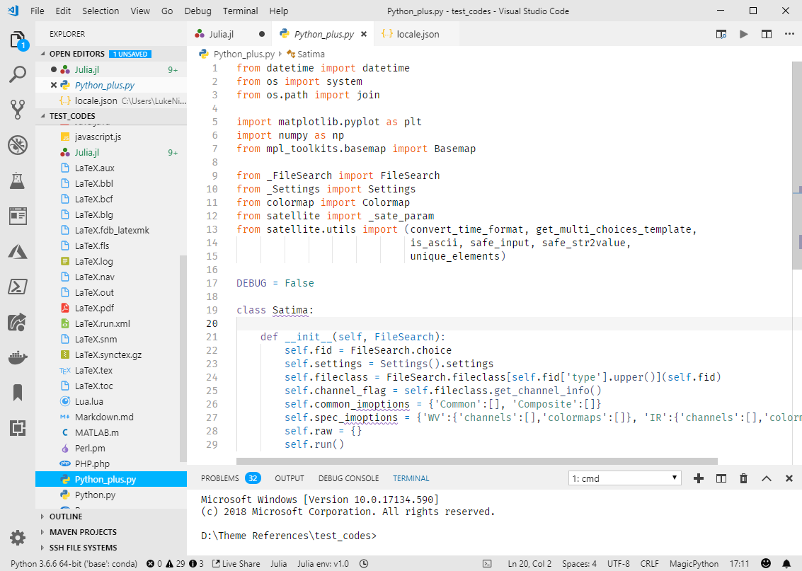

# Photonica


[](https://code.visualstudio.com/)
[](https://opensource.org/licenses/mit-license.php)
[](https://github.com/996icu/996.ICU/blob/master/LICENSE)


## About Photonica

A light theme is made for [VS Code](https://code.visualstudio.com/). A light theme for VS code. Its soft colors will be helpful for you to get inspired!

## Getting started

You can download and install this theme via the [Visual Studio Code Marketplace](https://marketplace.visualstudio.com/items?itemName=ConAntares.photonica).

## Installation

1. Launch Quick Open

   * Linux:    `Ctrl+P`
   * macOS:    `⌘P`
   * Windows:  `Ctrl+P`

    Paste the following command and press Enter:  
        ```ext Photonica```

    Or install it via sidebar panel in VS Code: Open Extension sidebar panel, and Search for "photonica";

2. Click Install to download and install it;
3. Click Reload to reload your VS Code;
4. Activate it:  
    ```Manage → Color Theme → Photonica```
5. Enjoy it !

## Screenshot

Python:



## Preferences shown in the screenshots

* The font  is [Fira Mono](https://github.com/mozilla/Fira).

## More information

* This theme is open source via  [GitHub Repository](https://github.com/ConAntares/Photonica/). I will feel happy if someone can develop his themes based on Photonica.

* If you like dark themes, please get to know [Luke Dark Theme](https://marketplace.visualstudio.com/items?itemName=ConAntares.luke-dark-theme).

## License

[MIT License](https://github.com/ConAntares/Photonica/blob/master/LICENSE)

## Follow me

* E-Mail: LukeNiu@outlook.com
* GitHub: Github.com/ConAntares

------
Enjoy it!  
✿✿ヽ(°▽°)ノ✿✿
